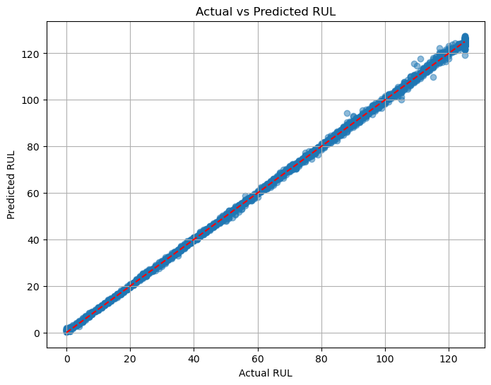
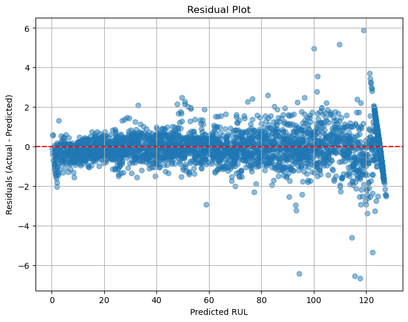

# Turbofan RUL Prediction (NASA C-MAPSS)

## Overview
This repository presents a deep learning framework for predicting the **Remaining Useful Life (RUL)** of turbofan engines using the **NASA C-MAPSS dataset**.  
A hybrid **CNN–BiLSTM–Attention model** has been implemented to capture both local degradation patterns and long-term temporal dependencies.  

The objective of this project is to demonstrate the application of advanced machine learning methods to predictive maintenance in aerospace systems.

---

## Features

### 1. Data Preprocessing and Feature Engineering
- Wavelet-based denoising to smooth noisy sensor signals.  
- Extraction of rolling statistics (mean, standard deviation) and delta features.  
- Implementation of piecewise-linear RUL labeling capped at 125 cycles.  

### 2. Hybrid Deep Learning Architecture
- Convolutional layers capture local degradation patterns across multiple time scales.  
- Bidirectional LSTM layers model long-term temporal dependencies.  
- Dual attention mechanisms highlight critical sensors and time steps.  
- Composite loss function (MSE + Huber) balances robustness and accuracy.  

### 3. Training and Optimization
- Hyperparameter tuning with Optuna across multiple dataset subsets.  
- Early stopping and checkpointing strategies to mitigate overfitting.  
- Modular training pipeline designed for reproducibility.  

### 4. Evaluation and Visualization
- Performance metrics include RMSE, MAE, and R².  
- Visualizations of predicted versus actual RUL trajectories.  
- Residual error distributions and attention weight plots.  

---

## Technologies Used
- **Programming Language:** Python 3.10  
- **Framework:** PyTorch (Apple MPS backend)  
- **Data Processing:** NumPy, pandas, scikit-learn  
- **Visualization:** Matplotlib, Seaborn  
- **Optimization:** Optuna  
- **Signal Processing:** PyWavelets  
- **Development Tools:** JupyterLab, Visual Studio Code  

---

## Data Sources
- **Dataset:** [NASA C-MAPSS Turbofan Engine Degradation Data](https://data.nasa.gov/dataset/C-MAPSS/)  
- Subsets FD001–FD004 cover different operating conditions and fault modes.  

---
## Visualizations

**Actual vs Predicted RUL (FD001)**  

**Residual Error Distribution (FD001)**  

## How to Run

1. Clone the Repository
git clone https://github.com/<YOUR_USERNAME>/turbofan-rul-cmapss.git
cd turbofan-rul-cmapss

2. Install Dependencies
pip install -r requirements.txt

3. Download the Dataset
Download the dataset from the NASA Prognostics Repository and place the files in the data/ directory.

4. Train and Evaluate
python experiments/final_retrain_evaluate.py

5. Run Hyperparameter Tuning
python experiments/optuna_tuning_per_dataset.py

References
- NASA C-MAPSS Turbofan Engine Degradation Data
- Guo et al. (2023), Zhang et al. (2024) – Hybrid attention-based RUL models
- Wu et al. (2020) – BiLSTM for C-MAPSS
- Yildirim & Rana (2024) – Hyperparameter tuning with Optuna

